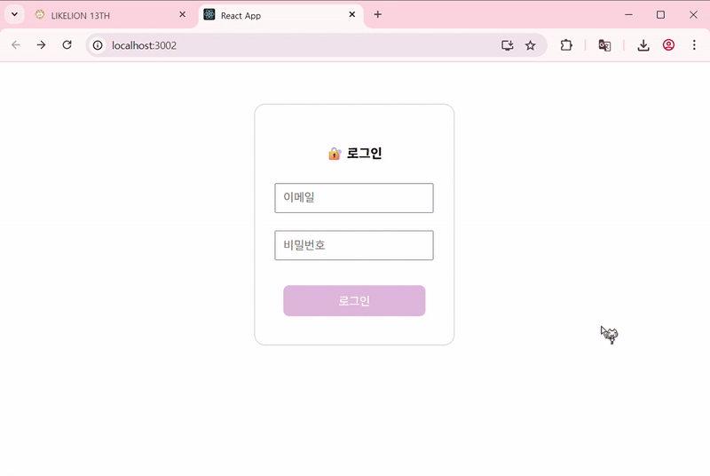

# 🦁 멋쟁이사자처럼 13기 React 마지막 세션 과제입니다 🦁

Axios를 사용하여 서버와 비동기통신하는 방법을 배웁니다.

 

## ⭐️⭐️⭐️ 과제 시작 방법 
- github 레포지토리를 fork 하신 다음, 본인 레포지토리에 들어가서 !!!복제된!!! 레포지토리를 로컬에 clone 해주세요!
- LoginPage.jsx / UserList.jsx / App.jsx 만 수정해주세요! 

 

## 💡 과제 설명

- 이번 세션에서 배운 Axios를 활용하여 서버와 비동기 통신을 구현하는 과제입니다.
- REST API 중 POST와 GET 메서드를 사용하여 데이터를 주고받아 보세요!

 

## ✅ 구현 방식

- `react-router-dom` 라이브러리를 사용하여 라우팅을 구현합니다.
- axios POST 요청을 통해 로그인하여 토큰을 받습니다.
- 사용자가 로그인 폼에 이메일과 비밀번호를 입력하고 로그인하면, 로그인 성공 시 서버에서 받은 토큰과 이메일을 localStorage에 저장합니다.
= 로그인 후에는 React Router의 useNavigate를 사용해 유저 목록 페이지로 이동합니다.
- 유저 목록 페이지에서는 localStorage에 저장된 토큰과 이메일을 화면 오른쪽 상단에 표시합니다.
- axios GET 요청을 통해 서버에서 사용자 데이터를 받아오고, 이름 또는 이메일을 기준으로 입력한 검색어에 따라 유저 목록을 필터링하여 보여주는 기능을 구현합니다.

## 🤷🏻‍♀️ 제출 방식

- '본인' 레포지토리에 pull request를 생성해주세요!
- 만들어진 PR 링크를 Lioz에 제출해주세요 !

